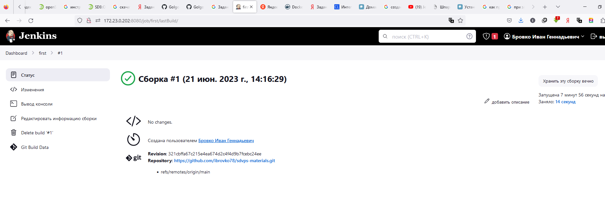
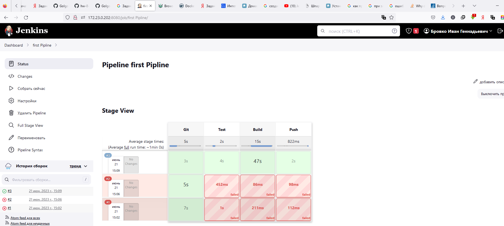

## Домашнее задание к занятию "`8-02 Что такое DevOps. СI/СD`" - `Бровко И.Г.`

### Инструкция по выполнению домашнего задания

   1. Сделайте `fork` данного репозитория к себе в Github и переименуйте его по названию или номеру занятия, например, https://github.com/имя-вашего-репозитория/git-hw или  https://github.com/имя-вашего-репозитория/7-1-ansible-hw).
   2. Выполните клонирование данного репозитория к себе на ПК с помощью команды `git clone`.
   3. Выполните домашнее задание и заполните у себя локально этот файл README.md:
      - впишите вверху название занятия и вашу фамилию и имя
      - в каждом задании добавьте решение в требуемом виде (текст/код/скриншоты/ссылка)
      - для корректного добавления скриншотов воспользуйтесь [инструкцией "Как вставить скриншот в шаблон с решением](https://github.com/netology-code/sys-pattern-homework/blob/main/screen-instruction.md)
      - при оформлении используйте возможности языка разметки md (коротко об этом можно посмотреть в [инструкции  по MarkDown](https://github.com/netology-code/sys-pattern-homework/blob/main/md-instruction.md))
   4. После завершения работы над домашним заданием сделайте коммит (`git commit -m "comment"`) и отправьте его на Github (`git push origin`);
   5. Для проверки домашнего задания преподавателем в личном кабинете прикрепите и отправьте ссылку на решение в виде md-файла в вашем Github.
   6. Любые вопросы по выполнению заданий спрашивайте в чате учебной группы и/или в разделе “Вопросы по заданию” в личном кабинете.
   
Желаем успехов в выполнении домашнего задания!
   
### Дополнительные материалы, которые могут быть полезны для выполнения задания

1. [Руководство по оформлению Markdown файлов](https://gist.github.com/Jekins/2bf2d0638163f1294637#Code)

---

### Задание 1

1. `Установливаю jenkins`
   * jenkins установлен  
   * Установка плагинов 
   * Jenkins Dashboard  
2. `Установливаю на машину с jenkins golang`
   * Версия golang 
3. `Используя свой аккаунт на GitHub, сделал себе форк репозитория https://github.com/netology-code/sdvps-materials.git` 
4. `Создайте в jenkins Freestyle Project, подключите получившийся репозиторий к нему и произведите запуск тестов и сборку проекта go test . и docker build ..`
   * 
   * 
   * 
   * 
---

### Задание 2

1. `Создаю новый проект pipeline.`
2. `Переписываю сборку из задания 1 на declarative в виде кода.`
   * 
   * 
   * 
   * 
---

### Задание 3

1. `Nexus установлен.`
2. `raw-hosted репозиторий создан.` 
3. `pipeline изменен так, чтобы вместо Docker-образа собирался бинарный go-файл.`
4. `файл загружен в репозиторий с помощью jenkins.` 
   * 
